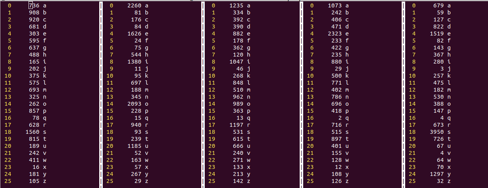

The table-music-proxy approach solves 2196/2309 words!<br>
These words are great to reduce the search space.

The first approach solves 2088 out of 2309 words ... not that bad ...

The Jon Gjengset `escore` implementation only fails to solve 19 words in no more than
6 attempts, which is amazing!!

```
$ cargo run --release -- --implementation escore
    Finished release [optimized + debuginfo] target(s) in 0.03s
     Running `target/release/roget --implementation escore`
 1:                                (0)
 2: #                              (90)
 3: ############                   (894)
 4: #############                  (999)
 5: ###                            (253)
 6: #                              (54)
 7:                                (15)
 8:                                (4)
average score: 3.7176
```

[https://github.com/jonhoo/roget](https://github.com/jonhoo/roget)

## Implementation

It uses a list made by hand which I suppose are good
candidates ..., if it doesn't find one there, then it chooses the first
one from the remaining list.

Some approaches that I guess are good:
  1. In each turn choose the word from the remaining list that
  eliminates most of the other words. Maybe it doesn't need to be from
  the remaining words and can be one from the dictionary ...
  2. In each turn calculate the frequency of each letter in each position
  and choose a remaining word based on that.

## Finding frequency of each letter in each position:


```sh
cut -c1-1 dictionary.txt | sort | uniq -c > dictionary-pos1-letter-frequency.txt
cut -c2-2 dictionary.txt | sort | uniq -c > dictionary-pos2-letter-frequency.txt
cut -c3-3 dictionary.txt | sort | uniq -c > dictionary-pos3-letter-frequency.txt
cut -c4-4 dictionary.txt | sort | uniq -c > dictionary-pos4-letter-frequency.txt
cut -c5-5 dictionary.txt | sort | uniq -c > dictionary-pos5-letter-frequency.txt
```



## Running

```sh
rustc w1.rs -o bin/w1 && time ./bin/w1 > failed-words.txt
```

## Compiling with optimization -> Huge difference!!!


```sh
rustc -O w1.rs -o bin/w1_optimized_level_2
```

```sh
$ time ./bin/w1 > /dev/null

real	0m21,125s
user	0m20,794s
sys	0m0,120s

$ time ./bin/w1_optimized_level_2 > /dev/null

real	0m0,785s
user	0m0,720s
sys	0m0,064s
```
